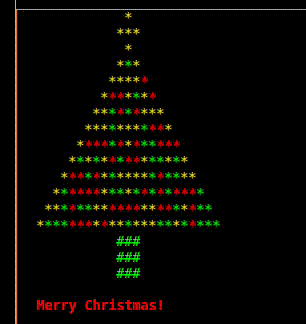

# Christmas Tree Animation

This Python program generates an animated Christmas tree in the console using ASCII art. The program defines the size of the tree and a list of colors for the tree to use. The program then repeatedly draws the tree with different randomized colors and waits for 4 seconds before reanimating.

## Prerequisites

To run this program, you will need Python 3 installed on your machine.

## How to Run

Open a command prompt or terminal.
Navigate to the directory where the script is saved.
Run the command ```python filename.py```, where filename.py is the name of the script file.

## Output

The program will output an animated ASCII art Christmas tree in the console. The tree will change colors with each animation, and a message "Merry Christmas!" will be displayed below the tree.



## References

This program uses the following Python modules:

**random** for randomly selecting colors for the tree.
**time** for waiting for a specified duration before reanimating.
**os** for clearing the console between animations.